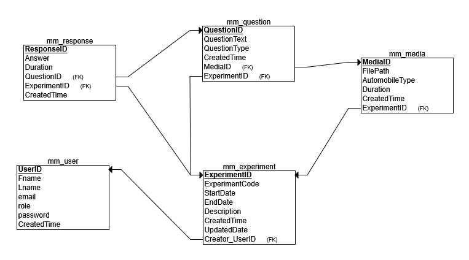

# VehicleSound-AnnoyanceSurveyApp

A web-based application to collect and analyze human perception of vehicle sound annoyance.

## Project Overview

This app allows users to listen to vehicle sounds (car, motorcycle, truck or other), classify them, and rate their loudness(annoyance level). Responses are stored for further analysis.

## Technology Stack

- **Backend:** Python (Flask)
- **Frontend:** HTML, CSS
- **Database:** MySQL
- **Data Analysis:** Python (Pandas, NumPy)

## User Roles
- Administrator: 
    - Has complete access to all features and resources.
    - Able to manage users, generate reports, and configure system settings.
- Standard User: 
    - Can access and interact with resources. 
    - Does not have permission to modify configurations or manage other users.

## User Credentials
- Users authenticate using their email address and password.
- Email: Serves as a unique identifier for each user.
- Password: Must be at least ?? characters long.
- The password is securely stored by hashing it with MD5.

## Authentication Process
- Registration: Users create an account by providing their email and setting a password.
- The system ensures the password meets the minimum length of 3 characters and is re-entered correctly to prevent errors.
- Passwords are hashed using MD5 before they are stored in the database for security.
- Login: Users log in by entering their email and password.
- The system validates the email and compares the entered password with the MD5 hashed password stored in the database.
- If the credentials are correct, a session is created to track the user’s activity throughout their session.
## Session Management:
- Upon successful login, a session is initiated to monitor the user's interactions with the application.

## Relational diagram

## SQL view queries
- CREATE TABLE mm_user
    (UserID INT NOT NULL, Fname VARCHAR(50) NOT NULL, Lname VARCHAR(50) NOT NULL, email VARCHAR(50) NOT NULL,
    role VARCHAR(50) NOT NULL, UserName VARCHAR(50) NOT NULL, PasswordHash VARCHAR(50) NOT NULL, AccessCode INT NOT NULL,
    CreatedTime DATE NOT NULL, PRIMARY KEY (UserID) );

- CREATE TABLE mm_experiment
    (ExperimentID INT NOT NULL, ExperimentName VARCHAR(100) NOT NULL, StartDate DATE NOT NULL, EndDate DATE NOT NULL,
    Description VARCHAR(100) NOT NULL, UpdatedDate DATE NOT NULL,  PRIMARY KEY (ExperimentID) );

- CREATE TABLE mm_media
    ( MediaID INT NOT NULL, FilePath VARCHAR(100) NOT NULL, AutomobileType VARCHAR(50) NOT NULL, Duration DATE NOT NULL,
    CreatedTime DATE NOT NULL, ExperimentID INT NOT NULL, PRIMARY KEY (MediaID), FOREIGN KEY (ExperimentID) REFERENCES mm_experiment(ExperimentID)
    );

- CREATE TABLE mm_question
    (QuestionID INT NOT NULL, QuestionText VARCHAR(1000) NOT NULL, QuestionType VARCHAR(50) NOT NULL, CreatedTime DATE NOT NULL,
    ExperimentID INT NOT NULL,  MediaID INT NOT NULL, PRIMARY KEY (QuestionID), FOREIGN KEY (ExperimentID) REFERENCES mm_experiment(ExperimentID),
    FOREIGN KEY (MediaID) REFERENCES mm_media(MediaID) );

- CREATE TABLE mm_response
    ( ResponseID INT NOT NULL, Value INT NOT NULL, VehicleGuess VARCHAR(50) NOT NULL, CorrectGuess CHAR(1) NOT NULL,
    CreatedTime DATE NOT NULL, Duration DATE NOT NULL, UserID INT NOT NULL, QuestionID INT NOT NULL, PRIMARY KEY (ResponseID),
    FOREIGN KEY (UserID) REFERENCES mm_user(UserID), FOREIGN KEY (QuestionID) REFERENCES mm_question(QuestionID) );